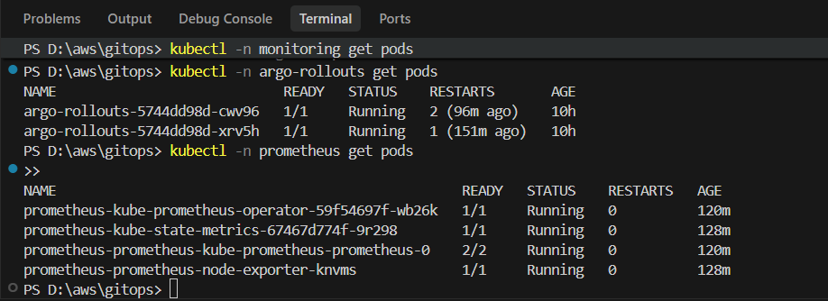
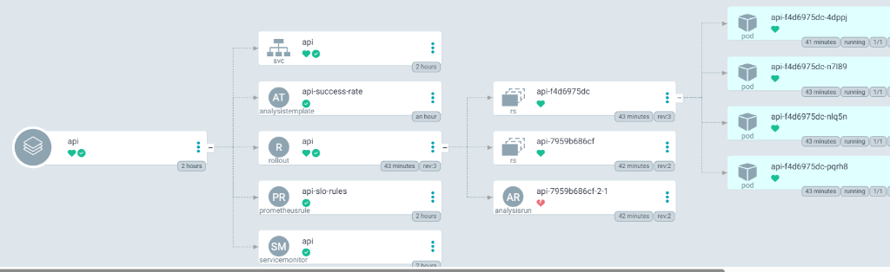
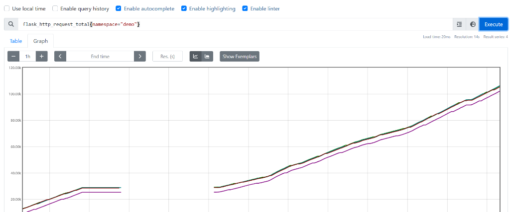
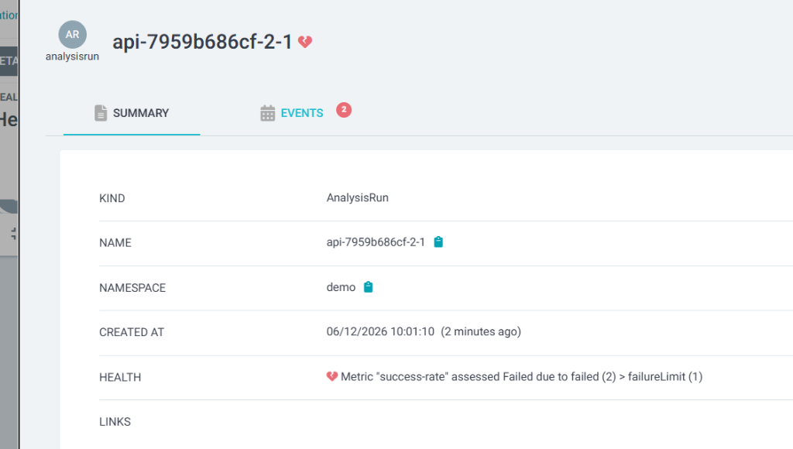

# Báo cáo Minh chứng Thực hành (Lab Evidence)

Tài liệu này tổng hợp hình ảnh minh chứng kết quả triển khai hệ thống GitOps, giám sát và phát hành tự động.

---

## Lab 1: Cài Prometheus + Argo Rollouts — qua GitOps

Giám sát cụm Kubernetes sử dụng Prometheus Operator và quản lý triển khai bằng Argo Rollouts. Các tài nguyên được cài đặt tự động qua các ứng dụng ArgoCD.

### Trạng thái các Pods đang hoạt động trong cụm:
- **Namespace `argo-rollouts`**: Các pods điều khiển Argo Rollouts hoạt động ổn định.
- **Namespace `prometheus`**: Các pods thu thập số liệu giám sát (operator, state-metrics, prometheus-server, node-exporter) đang chạy đầy đủ.



---

## Lab 2: Viết app Flask có /metrics → build image

Ứng dụng Flask phục vụ API được tích hợp sẵn endpoint `/metrics` để Prometheus thu thập số liệu. Sau đó, ứng dụng được đóng gói thành Docker image `w9-api:1` và nạp vào máy ảo Minikube.

### Lệnh kiểm tra hình ảnh bên trong cụm Minikube:
```powershell
minikube image ls -p minikube | Select-String "w9-api"
```

### Kết quả đầu ra:
```text
docker.io/library/w9-api:1
```
*(Kết quả này chứng minh ảnh `w9-api:1` đã được tải và sẵn sàng sử dụng trực tiếp trong cụm Minikube).*

---

## Lab 3: Viết k8s-api/ + Application → push → Prometheus thấy metric

Cấu hình các manifest Kubernetes bao gồm `Rollout`, `ServiceMonitor`, và `PrometheusRule` cho dịch vụ API. Các tài nguyên này được đồng bộ tự động qua ArgoCD.

### Sơ đồ cấu trúc tài nguyên của ứng dụng API trong ArgoCD:

*(Sơ đồ chứng minh các tài nguyên ServiceMonitor, PrometheusRule, và Rollout được cấu hình đúng và đang hoạt động lành mạnh trên cụm).*

### Truy vấn Metric `flask_http_request_total` trên Prometheus:

*(Đồ thị dạng Graph dốc đi lên chứng minh lượng request `flask_http_request_total` tăng dần liên tục theo thời gian khi load generator chạy).*

---

## Lab 4: Rollout thả canary tự động

Quá trình nâng cấp phiên bản ứng dụng được kiểm định an toàn tự động qua Argo Rollouts kết hợp Prometheus Analysis. 

Khi phiên bản lỗi được phát hiện, hệ thống tự động ngắt kết nối (Abort) và dịch chuyển toàn bộ traffic quay về phiên bản cũ ổn định (Rollback):


*(Hình ảnh chứng minh phép đo AnalysisRun phát hiện tỉ lệ thành công giảm sâu dưới ngưỡng 95% và tự động kích hoạt rollback).*
